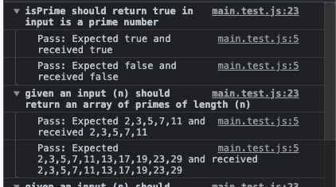
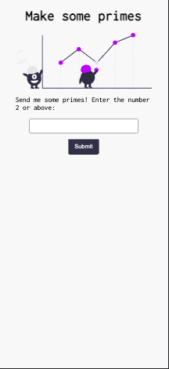
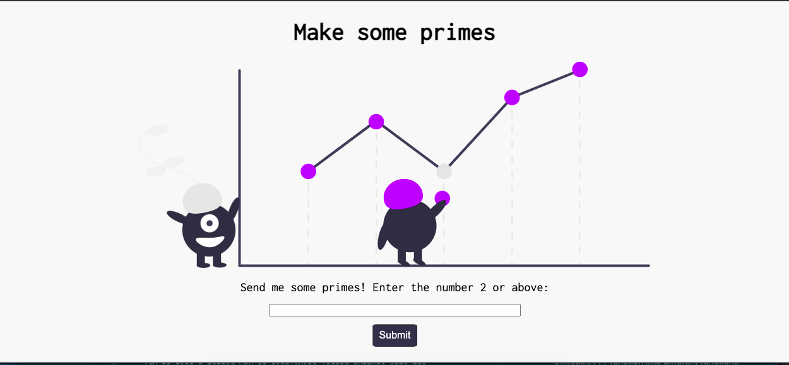
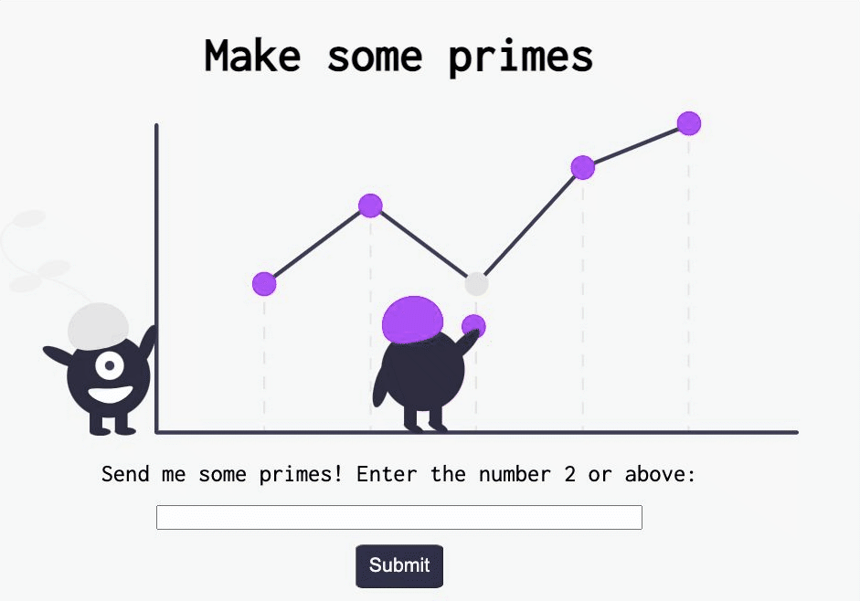

# Coding exercise - prime tables

Coding challenge for interview with Find My Past. This programme takes a numeric input (N) from a user and outputs a multiplication table of (N) prime numbers.

This programme runs in the browser. Please open [this page](https://moggach.github.io/primes_test/) to see it in action.

This project contains four functions that all perform specific tasks.

1. `function isPrime()` tests whether a given number input is prime.

2. `function primesArray()` takes a number input (n) from the user and generates an array of prime numbers of length (n). I believe that the big O notation of this part of the programme is O(n).

3. `function multiplyPrimes()` calls `primesArray()` and returns a nested array of multiples of the zero indexed array. I believe this is the least efficient part of the programme with a Big O notation of O(n2).

4. `function onSubmit()` takes the input (n) from the user and checks to see if it is greater than 1. Then it calls `multiplyPrimes()` and outputs the return value onto the page as a multiplication table. I believe that the `forEach()` function within this function has a Big O Notation of O(n).

## Example output (user input 3)

    |2|3|5
    2|4|6|10
    3|6|9|15
    5|10|15|25

## Testing 🧪

I wrote tests to cover the first three functions listed above. The tests output as expected:

I wasn't able to extract the logic to perform seperate tests on each step in the `onSubmit()` function. See below for what I would do if I had more time.

## Screenshots 👀

Mobile view:

Desktop view:

User input:

## What I'm pleased with

- I'm pleased that the programme runs with large numbers without hanging the browser.
- I like the use of template strings to display the multiplication table.

## What I would like to do next

- Separate out the logic contained within the `onSubmit()` function into different functions. This would enable better unit testing (see above).
- Try to find a more efficient way of producing the multiplication table without nested arrays
- Try to find a better way of displaying larger outputs onto the page. Right now they require the user to scroll/stretch the layout.
- I could also try to implement a version of the Sieve of Eratosthenes to check the primes.
